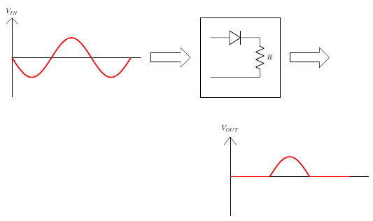

# Theory

### Rectification

Figure 1  

A rectifier is a device that converts alternating current (AC) to direct current (DC), a process known as rectification. Rectifiers are essentially of two types – a half wave rectifier and a full wave rectifier.

### Full Wave Rectifier

A full-wave rectifier is exactly the same as the half-wave, but allows unidirectional current through the load during the entire sinusoidal cycle (as opposed to only half the cycle in the half-wave). A full-wave rectifier converts the whole of the input waveform to one of constant polarity (positive or negative) at its output. Let us see our half wave rectifier example and deduce the circuit.

Figure 2  

For a half wave Rectifier this is what we have observed

Figure 3  

If we change the phase of the input waveform by 180 degrees

Figure 4  

Now if we add these two circuits, we would get

Figure 5  

### Full Wave Rectifier - Circuit

So, we have seen that this rectifier circuit consists of two sources which have a phase difference along with two diodes. When V1 is positive, V2 is negative. Hence the top diode(D1) will be a short and the bottom diode(D2) will be an open. On the other hand, when V1 is negative, V2 is positive. Hence the bottom diode(D2) will be on and the top diode(D1) will be an open circuit.

Figure 6  

### Full Wave Rectifier – Waveforms

Figure 7  

Figure 8  

Figure 9  

The resulting waveform of the schematic is shown above. This configuration is rarely used because sometimes it may be impractical to obtain two voltage sources and it is difficult to SYNC the sources. Let us see how a single source can be used.

### Full Wave Rectifier – Center Tapped Transformer

A Full-Wave Rectifier can be constructed using Center-Tapped transformer – which give us two shifted sinusoids so that exactly one of the waveforms is positive at one time and two diodes. As compared to the half wave rectifier we use two diodes instead of one, one of the two diodes remains in conduction in both of the half cycles. At any point in time, only one of the diodes is forward biased. This allows for continuous conduction through load.

Figure 10  

Figure 11  

$$\frac{N_p}{N_s} =\frac{V_p}{V_s}= \frac{1}{2}$$

$$V_S=2V_I$$

### Center Tapped Transformer – Positive cycle

Figure 12  

For Positive Cycle D1 is Forward Biased and D2 is Reverse Biased

$$V_I−V_O=0$$

$$⇒V_O=V_I$$

### Center Tapped Transformer– Negative cycle

Figure 13  

For Negative Cycle D1 is Reversed Biased and D2 is Forward Biased

$$V_I−V_O=0$$

$$⇒V_O=V_I$$

### Bridge Rectifier

Bridge rectifier uses 4 rectifying diodes connected in a "bridged" configuration to produce the desired output but does not require a special centre tapped transformer, thereby reducing its size and cost. The single secondary winding is connected to one side of the diode bridge network and the load to the other side as shown below.

Figure 14  

### Bridge Rectifier – Positive Half Cycle

During the positive half cycle of the supply diodes D1 and D2 conduct in series while diodes D3 and D4 are reverse biased (ideally they can be replaced with open circuits) and the current flows through the load as shown below.

Figure 15  

For Positive Half Cycle D1 and D2 is Forward Biased and D3 and D4 is Reverse Biased.

$$V_I−V_O=0$$

$$⇒V_O=V_I$$

$$V_O=V_I−2×V_b$$

$$V_O=V_I−2×V_b−2×I_{rd}$$

where,  
VI is the input voltage,  
Vb is barrier potential,  
rd is diode resistance

### Bridge Rectifier – Negative Half Cycle

During the negative half cycle of the supply, diodes D3 and D4 conduct in series, but diodes D1 and D2 switch of as they are now reverse biased. The current flowing through the load is the same direction as before.

Figure 16  

For Negative Half Cycle D1 and D2 is Reverse Biased and D3 and D4 is Forward Biased.

$$V_I−V_O=0$$

$$⇒V_O=V_I$$

### Average DC Load Voltage

$$V_O=V_m×sinwt$$ for $$0≤wt≤π$$

$$V_{av}=V_{dc}=\frac{2V_m}{π}$$

### Average Load Current

$$I_{av}=\frac{V_{av}}{R}=\frac{2×V_m}{π×R}$$

$$I_{av}=\frac{2×I_m}{R}$$

### RMS Load Current

$$I=I_m×sinwt$$ for $$0≤wt≤π$$

$$I_{rms}=\frac{I_m}{\sqrt{2}}$$

### RMS Load Voltage
$$V_{rms}=I_{rms}×R=\frac{I_m}{\sqrt{2}}×R$$

$$V_{rms}=\frac{V_m}{\sqrt{2}}$$

**Form factor:** It is defined as the ratio of rms load voltage and average load voltage.

$$F.F=\frac{V_{rms}}{V_{av}}$$

$$F.F=\frac{\frac{V_m}{\sqrt{2}}}{\frac{(2×V_m)}{π}}=\frac{π}{2\sqrt{2}}=1.11$$

$$F.F \geq 1$$

### Ripple Factor

$$\gamma= \sqrt ({F.F}^2-1 )\times 100\\%$$

$$\gamma=\sqrt ({1.11}^2-1) \times 100\\%=48.1\\%$$

Efficiency:It is defined as ratio of dc power available at the load to the input ac power.

$$n\\%=\frac{P_{load}}{P_{in}}$$×100\\%

$$n\\%=\frac{(I_{dc}^2×R)}{(I_{rms}^2×R)}×100\\%$$

$$n\\%=\frac{\frac {4 \times I_{m}^2}{\pi^2}}{\frac{I_{m}^2}{2}}\times 100\\%=\frac{8}{\pi^2}\times 100\\% =81.13$$

### Peak Inverse Volatge

For rectifier applications, peak inverse voltage (PIV) or peak reverse voltage (PRV) is the maximum value of reverse voltage which occurs at the peak of the input cycle when the diode is reverse-biased.The portion of the sinusoidal waveform which repeats or duplicates itself is known as the cycle. The part of the cycle above the horizontal axis is called the positive half-cycle, the part of the cycle below the horizontal axis is called the negative half cycle. With reference to the amplitude of the cycle, the peak inverse voltage is specified as the maximum negative value of the sine-wave within a cycle's negative half cycle.

For Bridge Rectifier,
D1 and D2 is Forward Biased
D3 and D4 is Reverse Biased

$$V_m-V_O=0$$

$$\Rightarrow V_O=V_m$$

$$V_O+PIV=0$$

$$PIV=V_m$$

$$PIV \geq V_m$$

For Center Tapped Rectifier,
D2 is Forward Biased,
PIV at D1,

$$V_m−V_O=0$$
 

$$\Rightarrow V_O=V_m$$

$$V_O−PIV+V_m$$

$$⇒PIV=2V_m$$

$$PIV \geq 2Vm$$

### Note

An alternative representation of full-wave bridge rectifier circuit is easier both to remember and to comprehend. It's the exact same circuit, except all diodes are drawn in a horizontal attitude, all “pointing” the same direction.

Figure 17  

