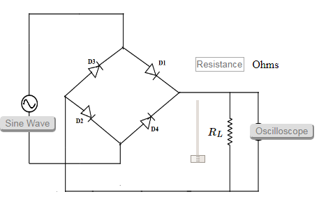

### Procedure

1. Set the resistor RL.
2. Click on 'ON' button to start the experiment.
3. Click on 'Sine Wave' button to generate input waveform
4. Click on 'Oscilloscope' button to get the rectified output.
5. Vary the Amplitude, Frequency, volt/div using the controllers.
6. Click on "Dual" button to observe both the waveform.
7. Channel 1 shows the input sine waveform, Channel 2 shows the output rectified waveform.
8. Calculate the Ripple Factor.Theoretical Ripple Factor= 0.483.

Figure:1

### Calculation

   Measure the $$V_m$$

   $$V_{rms}=\frac{V_m}{\sqrt 2}$$

   $$V_{dc}=\frac{2V_m}{π}$$
    

   Ripple Factor= $$\frac{V_{ac}}{V_{dc}}$$
     
   Since, 

   $$V_{ac}=\sqrt {(V_{rms}^2−V_{dc}^2)}$$

